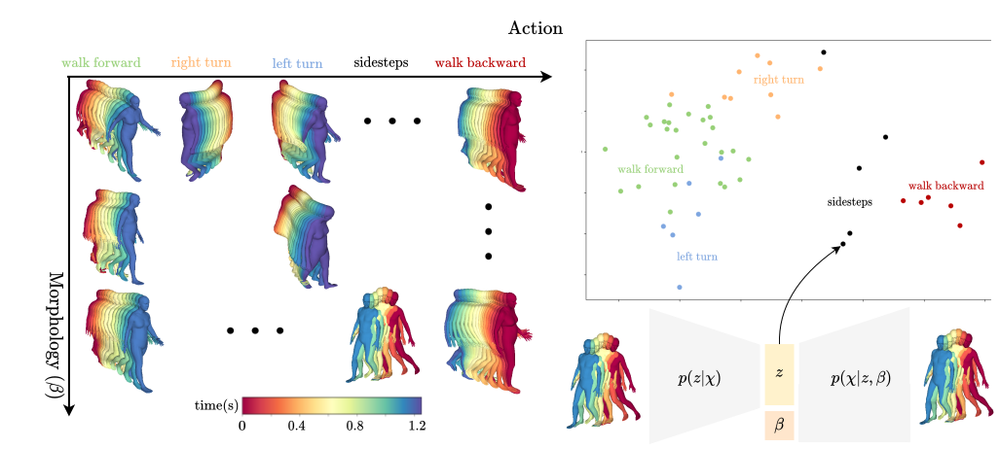

# A Structured Latent Space For Human Body Motion Generation 

# Description

Modelling plausible 3D human body motion in a structured low dimensional representation can be benefitial for many 3D vision tasks such as motion transfer, completion or interpolation. We propose a low dimensional representation of motion which disentangles the influence of body shape and motion by leveraging a Variational Autoencoder framework.

# Code 

The code and installation guidelines are available on Gitlab at the following adress https://gitlab.inria.fr/mmarsot/a-structured-latent-space 

# Paper

This work was published at the 2022 International Conference on 3D Vision (3DV). If you use it, please cite the following : 

@inproceedings{marsot2022structured,
  title={A Structured Latent Space For Human Body Motion Generation},
  author={M. Marsot and S. Wuhrer and J.S. Franco and S. Durocher},
  booktitle={2022 International Conference on 3D Vision (3DV)},
  year={2022},
}
